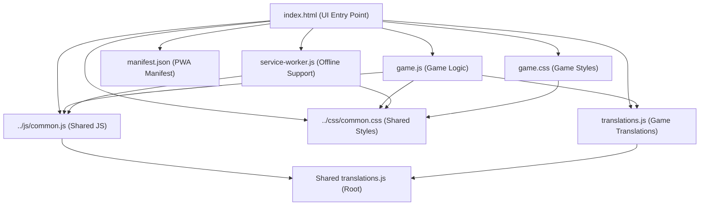
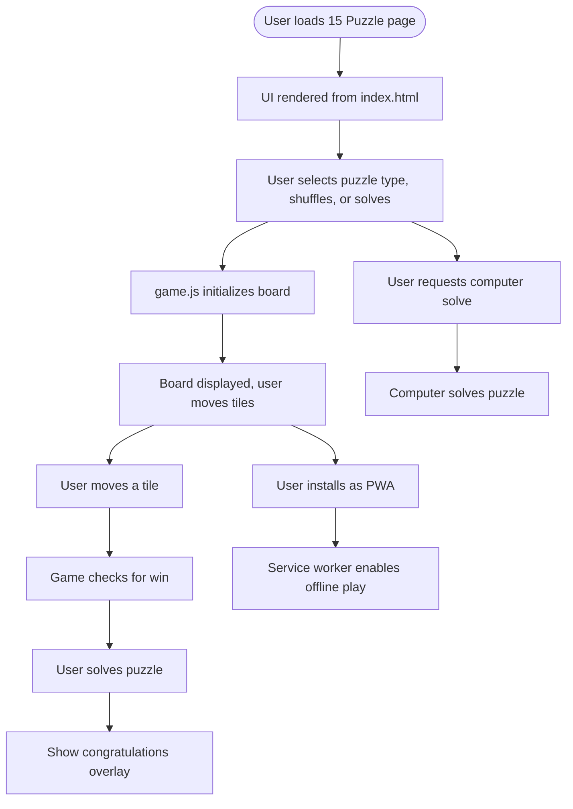

# 15 Puzzle Game Architecture & Documentation

## Component Architecture Diagram

## User Flow Diagram

---

## File Roles & Structure

- **index.html**: Sets up the UI, loads all resources, integrates PWA features, and initializes the game.
- **game.js**: Handles board creation, user input, game state, tile movement, shuffling, computer solving, and win logic.
- **game.css**: Styles the board, tiles, controls, overlays, and ensures responsive design.
- **translations.js**: Provides all UI text in 12 languages for full localization.
- **manifest.json**: Configures PWA installability, icons, and theme.
- **service-worker.js**: Caches files for offline play and updates cache as needed.
- **../css/common.css**: Shared styles for consistent look and feel.
- **../js/common.js**: Shared language, i18n, and release note utilities.

---

## Game Rules, Controls, and User Interactions

- **Goal**: Arrange the tiles in order (1-8 or 1-15) by sliding them into the empty space. Solve the puzzle in as few moves as possible.
- **Controls**:
  - Select puzzle type (8 or 15)
  - Shuffle: Randomize the board
  - Solve: Let the computer solve the puzzle
  - Move tiles by clicking
  - Language selection (via shared/common.js, if enabled)
- **Feedback**:
  - Move counters for player, random, and computer moves
  - Congratulations overlay when solved
  - Computer solving progress and giving up message

---

## Unique Features & PWA Aspects

- Option for 8-puzzle or 15-puzzle
- Computer can solve the puzzle (with progress feedback)
- Fully localized UI (12 languages)
- Responsive and mobile-friendly design
- PWA installability and offline support
- Uses shared resources for consistency

---

## Notable Implementation Details

- Board is dynamically rendered for each puzzle type
- Computer solver uses advanced search algorithms (IDA*, heuristics)
- Modular JS with global event handling and error management
- Service worker caches all required files for offline play
- Easily extensible for new features, translations, or UI improvements 