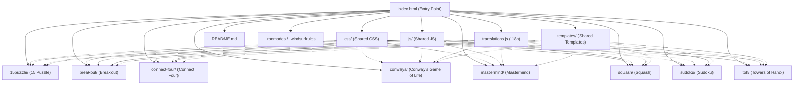

# Project Structure Overview

## Folder Hierarchy

- 15puzzle/
- breakout/
- connect-four/
- conways/
- css/
- js/
- mastermind/
- squash/
- sudoku/
- templates/
- toh/
- .git/
- .taskmaster/
- .cursor/
- .roo/

Top-level files:
- index.html
- README.md
- translations.js
- .roomodes
- .windsurfrules
- .gitignore
- .DS_Store

## Game Components

Each game is organized in its own folder at the project root:
- 15puzzle/ : 15 Puzzle
- breakout/ : Breakout
- connect-four/ : Connect Four
- conways/ : Conway's Game of Life
- mastermind/ : Mastermind
- squash/ : Squash
- sudoku/ : Sudoku
- toh/ : Towers of Hanoi

## Shared Resources

- css/ : Shared CSS files (e.g., common.css)
- js/ : Shared JavaScript files (e.g., common.js)
- translations.js : Root-level file for internationalization
- templates/ : Shared HTML/templates for UI components
- README.md : Project documentation
- .roomodes, .windsurfrules : Special config/rule files for development tools or project-specific rules

## index.html Analysis

- References shared resources:
  - `<link rel="stylesheet" href="./css/common.css">`
  - ``
  - ``
- Provides navigation links to each game (e.g., sudoku/index.html, connect-four/index.html, etc.)
- Uses data-i18n attributes and a language selector for multi-language support
- Contains containers for release notes and version info

## Visual Diagram (Mermaid Syntax)

The following diagram shows the relationships between the entry point, game folders, and shared resources. Solid lines represent direct references from index.html; dotted lines show shared resources used by individual games.

**Legend:**
- **Solid lines**: Direct references from index.html
- **Dotted lines**: Shared resources used by individual games

## Notes
- Special folders (.taskmaster/, .cursor/, .roo/) and files (.roomodes, .windsurfrules) are likely related to development tooling or project-specific rules.
- The project supports multi-language UI and version/release notes, as seen in index.html. 