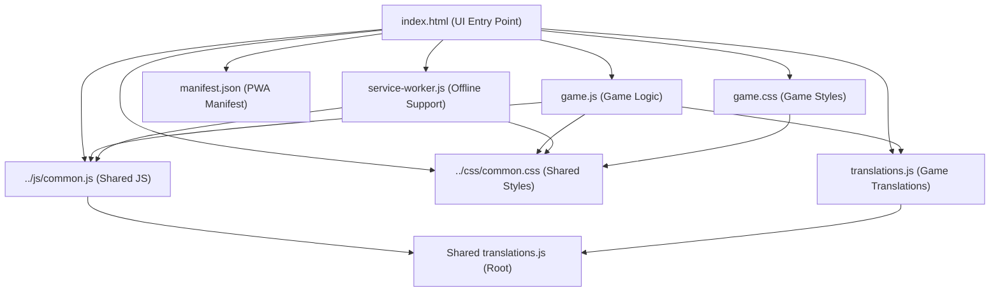
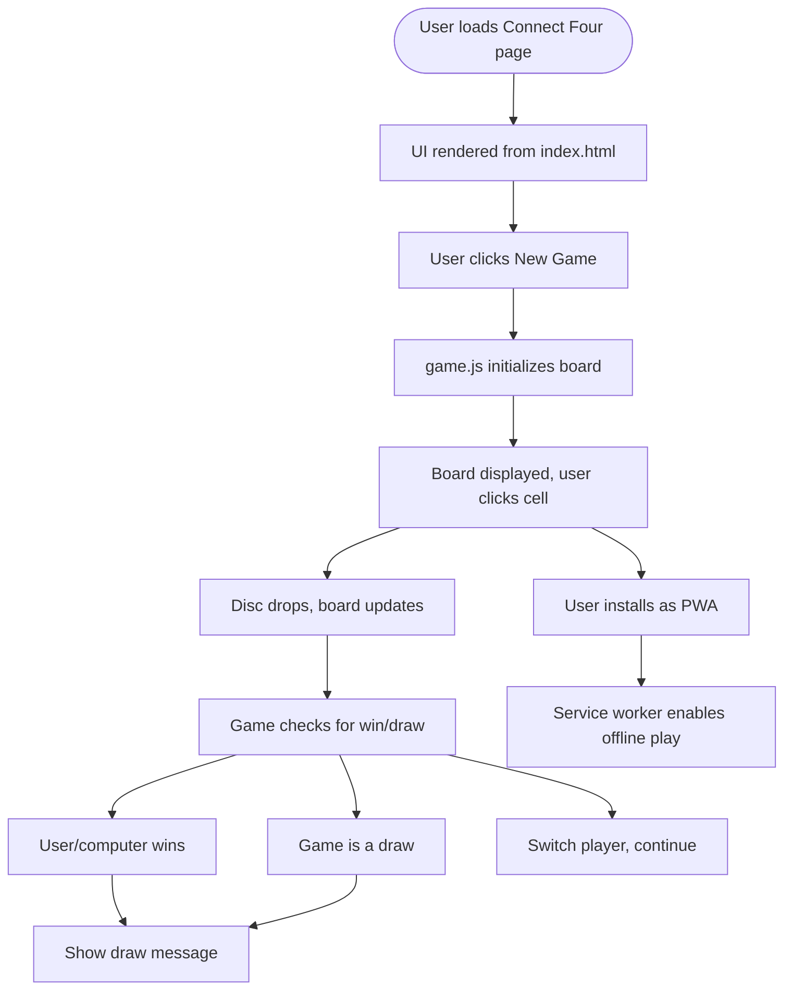

# Connect Four Game Architecture & Documentation

## Component Architecture Diagram

## User Flow Diagram

---

## File Roles & Structure

- **index.html**: Sets up the UI, loads all resources, integrates PWA features, and initializes the game.
- **game.js**: Handles board creation, user input, game state, AI opponent, win/draw logic, and animations.
- **game.css**: Styles the board, cells, controls, and win/draw overlays. Responsive and animated.
- **translations.js**: Provides all UI text in 12 languages for full localization.
- **manifest.json**: Configures PWA installability, icons, and theme.
- **service-worker.js**: Caches files for offline play and updates cache as needed.
- **../css/common.css**: Shared styles for consistent look and feel.
- **../js/common.js**: Shared language, i18n, and release note utilities.

---

## Game Rules, Controls, and User Interactions

- **Goal**: Drop discs into a 7x6 grid to connect four of your color in a row (horizontally, vertically, or diagonally) before the computer does.
- **Controls**:
  - Click a column to drop your disc
  - New Game: Reset the board
  - Language selection (via shared/common.js, if enabled)
- **Feedback**:
  - Animated disc drops
  - Win/draw messages and overlays
  - Computer opponent moves automatically

---

## Unique Features & PWA Aspects

- Fully localized UI (12 languages)
- Responsive and mobile-friendly design
- PWA installability and offline support
- Animated overlays and feedback (fireworks, proud computer)
- AI opponent using minimax algorithm
- Uses shared resources for consistency

---

## Notable Implementation Details

- Board is a 2D array, rendered as a grid of clickable cells
- Minimax-based AI for computer moves
- CSS variables and shared styles for maintainability
- Modular JS with global event handling and error management
- Service worker caches all required files for offline play
- Easily extensible for new features, translations, or UI improvements 