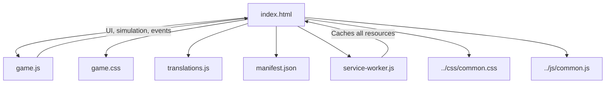
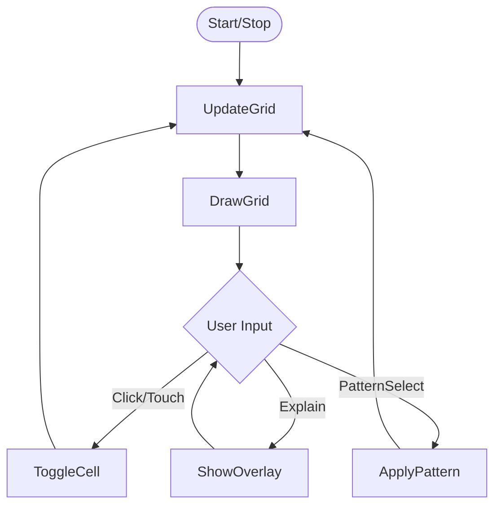

# Conway's Game of Life Architecture & Documentation

## Overview
Conway's Game of Life is a browser-based cellular automaton simulation with a rich UI, pattern selection, multilingual support, and PWA features for installability and offline play. It leverages shared project resources for styling and utility functions, and provides an interactive, educational experience.

---

## File Structure

```
conways/
  ├── index.html           # Main HTML entry point
  ├── game.js              # Game logic, UI, and controls
  ├── game.css             # Game-specific styles
  ├── translations.js      # Localized strings for UI and rules
  ├── manifest.json        # PWA manifest for installability
  ├── service-worker.js    # Offline support and caching
  ├── icon-192x192.png     # App icon (PWA)
  ├── icon-512x512.png     # App icon (PWA)
  └── favicon.ico          # Favicon
```

---

## Component Diagram (Mermaid)



---

## Main Components & Roles

- **index.html**: Loads all resources, sets up the UI, and registers the service worker for PWA support.
- **game.js**: Implements the Game of Life logic, rendering, controls, and UI overlays. Handles:
  - Simulation loop and grid updates
  - Pattern selection and randomization
  - Touch and mouse controls for toggling cells
  - Explanation overlay and rules display
  - Generation counter and state detection (extinction, steady state, oscillators)
- **game.css**: Styles the game area, overlays, controls, and ensures responsive design for mobile and desktop.
- **translations.js**: Provides UI, rules, and explanation strings in multiple languages.
- **manifest.json**: Enables PWA installability, icons, and theming.
- **service-worker.js**: Caches all game and shared resources for offline play.
- **common.css/js**: Shared styling and utility functions across all games.

---

## Controls & User Flow

- **Start/Stop**: Begin or pause the simulation
- **Clear**: Reset the grid
- **Random**: Fill the grid with a random pattern
- **Pattern Select**: Choose from predefined patterns (still life, oscillator, spaceship, infinite)
- **Explain**: Show overlay with rules and explanation
- **Canvas**: Click/tap to toggle cell state
- **Touch/Mouse**: Drag to toggle multiple cells

#### Control Flow Diagram


---

## PWA & Offline Support
- **manifest.json**: Defines app name, icons, theme, and start URL for installability.
- **service-worker.js**: Caches all game and shared resources, enabling offline play and fast loading.
- **index.html**: Registers the service worker on load.

---

## Localization
- All UI strings, rules, and explanations are localized in `translations.js`.
- Languages supported: en, de, fr, it, sv, sk, es, pt, no, fi, pl, cs, and more.
- Rules and overlays are fully translated for educational accessibility.

---

## Unique Features
- **Pattern Selection**: Users can select from random, still life, oscillator, spaceship, and infinite patterns, or keep the current grid.
- **Explanation Overlay**: Modal overlay provides rules and educational content in the user's language.
- **Color/Age Visualization**: Living cells are colored by age, cycling through hues for visual effect.
- **State Detection**: Detects extinction, steady state, and oscillators, displaying messages accordingly.
- **Responsive Design**: CSS ensures playability and readability on all screen sizes.
- **Release Notes**: Version and feature notes are displayed in the UI.

---

## Extensibility Notes
- **Adding New Languages**: Extend `translations.js` with new language keys and values.
- **Customizing Patterns**: Add new patterns to the `patterns` object in `game.js`.
- **UI Enhancements**: Modify `game.js` and `game.css` to add new controls or overlays.
- **PWA Enhancements**: Update `manifest.json` and `service-worker.js` for new features or assets.
- **Shared Resource Updates**: Changes to `common.css` or `common.js` propagate to all games.

---

## Rules & Best Practices
- Keep all UI, rules, and explanations localized.
- Use overlays for educational content and accessibility.
- Use shared resources for consistency across games.
- Document all new features and changes in this file and in release notes.
- For new patterns or features, ensure they are accessible via both UI and localization.

---

## References
- [../css/common.css](../css/common.css)
- [../js/common.js](../js/common.js)
- [translations.js](translations.js)
- [manifest.json](manifest.json)
- [service-worker.js](service-worker.js) 