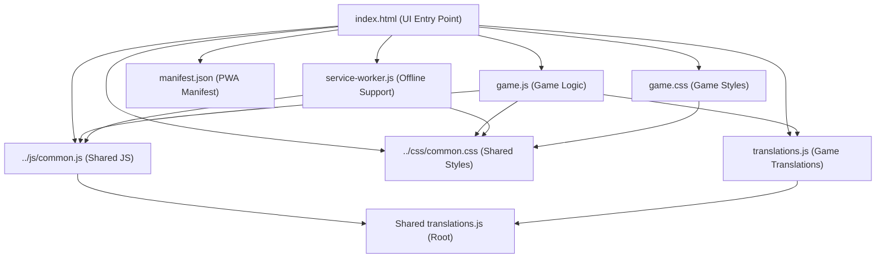
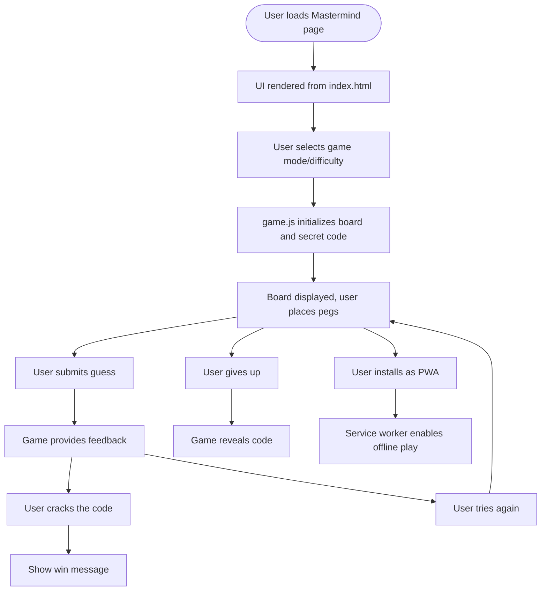

# Mastermind Game Architecture & Documentation

## Component Architecture Diagram

## User Flow Diagram

---

## File Roles & Structure

- **index.html**: Sets up the UI, loads all resources, integrates PWA features, and initializes the game.
- **game.js**: Handles board creation, user input, game state, code generation, feedback, and win/loss logic.
- **game.css**: Styles the board, pegs, controls, overlays, and ensures responsive design.
- **translations.js**: Provides all UI text in 12 languages for full localization.
- **manifest.json**: Configures PWA installability, icons, and theme.
- **service-worker.js**: Caches files for offline play and updates cache as needed.
- **../css/common.css**: Shared styles for consistent look and feel.
- **../js/common.js**: Shared language, i18n, and release note utilities.

---

## Game Rules, Controls, and User Interactions

- **Goal**: Guess the secret code (colors or digits) in as few attempts as possible. Feedback is given after each guess (black/white pegs for correct color/digit and position).
- **Controls**:
  - Select game mode (colors/digits, with/without repetition, code length)
  - Place pegs by clicking or dragging
  - Submit guess
  - Restart game
  - Give up to reveal the code
  - Language selection (via shared/common.js, if enabled)
- **Feedback**:
  - Black/white pegs for guess accuracy
  - Win/loss messages and overlays

---

## Unique Features & PWA Aspects

- Multiple game modes (colors, digits, repetition, code length)
- Fully localized UI (12 languages)
- Responsive and mobile-friendly design
- PWA installability and offline support
- Drag-and-drop and click placement of pegs
- Uses shared resources for consistency

---

## Notable Implementation Details

- Board is dynamically rendered for each attempt
- Secret code generation supports multiple modes
- Modular JS with global event handling and error management
- Service worker caches all required files for offline play
- Easily extensible for new features, translations, or UI improvements 