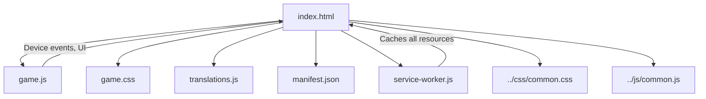
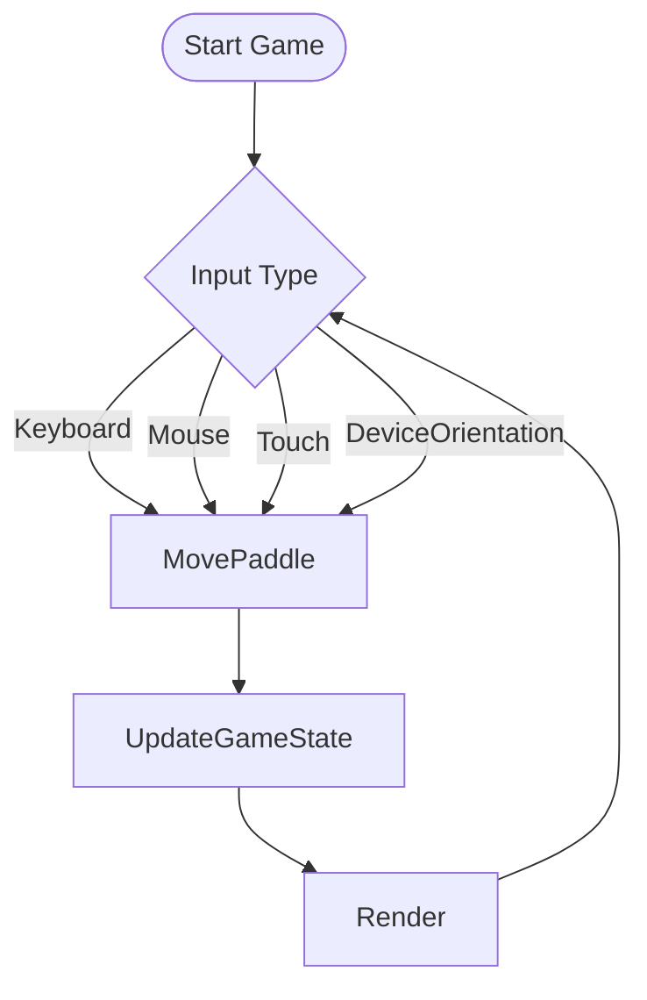

# Squash Game Architecture & Documentation

## Overview
Squash is a browser-based paddle game supporting both desktop and mobile controls, with PWA features for installability and offline play. It is fully localized and leverages shared project resources for styling and utility functions.

---

## File Structure

```
squash/
  ├── index.html           # Main HTML entry point
  ├── game.js              # Game logic (desktop & mobile controls)
  ├── game.css             # Game-specific styles
  ├── translations.js      # Localized strings for UI and controls
  ├── manifest.json        # PWA manifest for installability
  ├── service-worker.js    # Offline support and caching
  ├── icon-192x192.png     # App icon (PWA)
  ├── icon-512x512.png     # App icon (PWA)
  └── favicon.ico          # Favicon
```

---

## Component Diagram (Mermaid)



---

## Main Components & Roles

- **index.html**: Loads all resources, sets up the canvas, and registers the service worker for PWA support.
- **game.js**: Implements game logic, rendering, and controls. Handles:
  - Keyboard (desktop)
  - Mouse (desktop)
  - Touch (mobile)
  - Device orientation (mobile tilt)
  - Fallbacks for unsupported devices
- **game.css**: Styles the game area, buttons, and ensures responsive design for mobile.
- **translations.js**: Provides UI and control instructions in multiple languages, including mobile-specific instructions.
- **manifest.json**: Enables PWA installability, icons, and theming.
- **service-worker.js**: Caches all game and shared resources for offline play.
- **common.css/js**: Shared styling and utility functions across all games.

---

## Controls & User Flow

### Desktop
- **Arrow keys**: Move paddle left/right
- **Mouse**: Move paddle horizontally

### Mobile
- **Touch**: Drag paddle
- **Tilt**: Move paddle using device orientation (if supported and permitted)
  - iOS: Requests permission for device orientation
  - Android: Uses deviceorientation event directly
  - Fallback: Touch controls if orientation not available

#### Control Flow Diagram


---

## PWA & Offline Support
- **manifest.json**: Defines app name, icons, theme, and start URL for installability.
- **service-worker.js**: Caches all game and shared resources, enabling offline play and fast loading.
- **index.html**: Registers the service worker on load.

---

## Localization
- All UI strings and control instructions are localized in `translations.js`.
- Languages supported: en, de, fr, it, sv, sk, es, pt, no, fi, pl, cs.
- Mobile-specific instructions are provided for each language.

---

## Unique Features
- **Mobile Tilt Controls**: Uses `deviceorientation` events to allow paddle movement by tilting the device. Includes:
  - iOS permission request (iOS 13+)
  - Android/legacy support
  - Fallback to touch if not available or denied
  - User feedback if orientation is unavailable
- **Spin & Speed Mechanics**: Paddle movement imparts spin to the ball; speed increases over time for added challenge.
- **Responsive Design**: CSS ensures playability on all screen sizes.
- **Release Notes**: Version and feature notes are displayed in the UI.

---

## Extensibility Notes
- **Adding New Languages**: Extend `translations.js` with new language keys and values.
- **Customizing Controls**: Modify `game.js` to add new input methods or tweak paddle/ball physics.
- **PWA Enhancements**: Update `manifest.json` and `service-worker.js` for new features or assets.
- **Shared Resource Updates**: Changes to `common.css` or `common.js` propagate to all games.

---

## Rules & Best Practices
- Always provide fallbacks for device-specific features.
- Keep all UI and control instructions localized.
- Use shared resources for consistency across games.
- Document all new features and changes in this file and in release notes.

---

## References
- [../css/common.css](../css/common.css)
- [../js/common.js](../js/common.js)
- [translations.js](translations.js)
- [manifest.json](manifest.json)
- [service-worker.js](service-worker.js) 