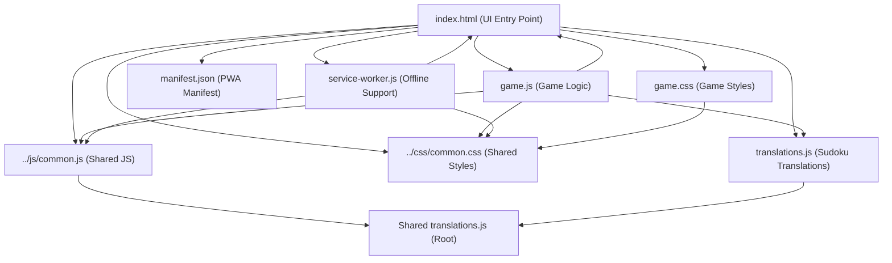
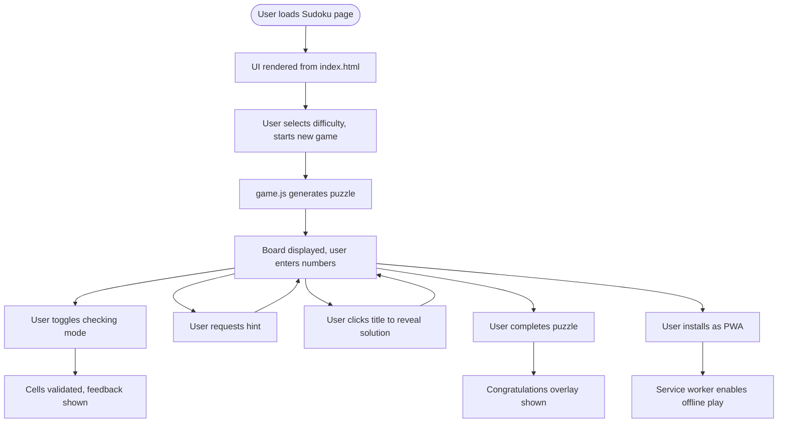

# Sudoku Game Architecture & Documentation

## Component Architecture Diagram

## User Flow Diagram

---

## File Roles & Structure

- **index.html**: Sets up the UI, loads all resources, integrates PWA features, and initializes the game.
- **game.js**: Handles puzzle generation, validation, user input, hints, solution reveal, and game state.
- **game.css**: Styles the board, controls, overlays, and ensures responsive design.
- **translations.js**: Provides all UI text in 12 languages for full localization.
- **manifest.json**: Configures PWA installability, icons, and theme.
- **service-worker.js**: Caches files for offline play and updates cache as needed.
- **../css/common.css**: Shared styles for consistent look and feel.
- **../js/common.js**: Shared language, i18n, and release note utilities.

---

## Game Rules, Controls, and User Interactions

- **Goal**: Fill the 9x9 grid so each row, column, and 3x3 box contains the digits 1-9 exactly once.
- **Controls**:
  - Difficulty selector: Choose puzzle difficulty
  - New Game: Generate a new puzzle
  - Toggle Checking: Enable/disable real-time validation
  - Board: Click/tap cells to enter numbers
  - Hint: Enter "?" or "0" in a cell to reveal the correct value
  - Solution: Click the title to reveal/hide the full solution
- **Feedback**:
  - Incorrect entries are highlighted
  - Congratulations overlay appears when solved
  - Hints and solution are visually distinct

---

## Unique Features & PWA Aspects

- Fully localized UI (12 languages)
- Responsive and mobile-friendly design
- PWA installability and offline support
- Animated overlays and feedback
- Hints and solution reveal for accessibility
- Uses shared resources for consistency

---

## Notable Implementation Details

- Puzzle generation ensures unique solutions for each difficulty
- Uses CSS variables and shared styles for maintainability
- Modular JS with global event handling and error management
- Service worker caches all required files for offline play
- Easily extensible for new features, translations, or UI improvements 