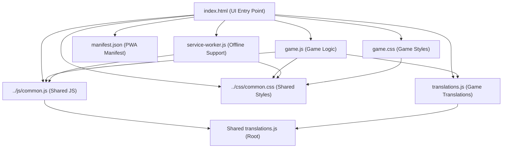
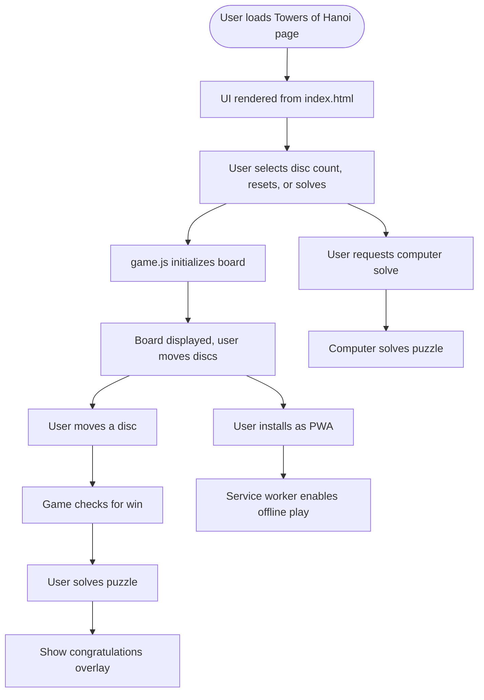

# Towers of Hanoi Game Architecture & Documentation

## Component Architecture Diagram

## User Flow Diagram

---

## File Roles & Structure

- **index.html**: Sets up the UI, loads all resources, integrates PWA features, and initializes the game.
- **game.js**: Handles board creation, user input, game state, disc movement, animation, computer solving, and win logic.
- **game.css**: Styles the board, towers, discs, controls, overlays, and ensures responsive design.
- **translations.js**: Provides all UI text in 12 languages for full localization.
- **manifest.json**: Configures PWA installability, icons, and theme.
- **service-worker.js**: Caches files for offline play and updates cache as needed.
- **../css/common.css**: Shared styles for consistent look and feel.
- **../js/common.js**: Shared language, i18n, and release note utilities.

---

## Game Rules, Controls, and User Interactions

- **Goal**: Move all discs from the first tower to the third, following the rules: only one disc at a time, no larger disc on a smaller one, and only the top disc can be moved.
- **Controls**:
  - Select number of discs (3–6)
  - Reset: Restart the puzzle
  - Solve: Let the computer solve the puzzle
  - Move discs by clicking towers
  - Language selection (via shared/common.js, if enabled)
- **Feedback**:
  - Move counter (current and minimum moves)
  - Congratulations overlay when solved
  - Computer solving progress

---

## Unique Features & PWA Aspects

- Adjustable disc count (3–6)
- Computer can solve the puzzle (with animation)
- Fully localized UI (12 languages)
- Responsive and mobile-friendly design
- PWA installability and offline support
- Uses shared resources for consistency

---

## Notable Implementation Details

- Board and discs are dynamically rendered and animated
- Computer solver uses recursive algorithm
- Modular JS with global event handling and error management
- Service worker caches all required files for offline play
- Easily extensible for new features, translations, or UI improvements 